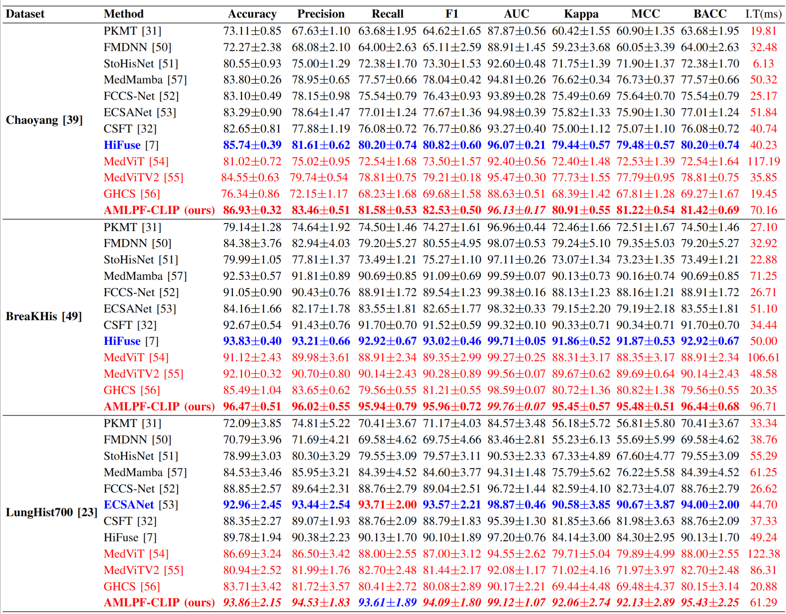

# AMLPF-CLIP

**AMLPF-CLIP** is an improved CLIP-based framework for histopathological image classification (HIC) that addresses key challenges in computer-aided diagnosis by integrating adaptive multi-level prompt fusion, class-balanced resampling, and cross-architecture knowledge distillation. This repository provides code and implementation details for the approach described in our upcoming paper.

## Overview

Histopathological image classification is critical for effective cancer screening, disease grading, and treatment planning. Despite advances with deep learning models, existing methods face limitations in integrating domain-specific pathology knowledge, handling class imbalance, and managing high computational costs. Our method, **AMLPF-CLIP**, leverages:

- **Adaptive Multi-Level Prompt Fusion (AMLPF):** Dynamically integrates multi-tiered, domain-specific textual cues to enhance the semantic alignment between visual and textual modalities. 
- **Class-Balanced Resampling:** Adjusts sampling weights based on class-specific accuracy to mitigate bias in imbalanced datasets.
- **Cross-Architecture Knowledge Distillation:** Transfers predictive knowledge from a high-capacity ViT-based teacher model to a lightweight CLIP-based student model using L2 norm–based alignment, thereby preserving high performance while reducing computational cost.


<!--
## Repository Contents

- **/code:** Source code for implementing AMLPF-CLIP.
- **/configs:** Configuration files for training and evaluation.
- **/experiments:** Scripts and notebooks for reproducing our experimental results on benchmark datasets.
- **/docs:** Documentation and further details regarding architecture, training procedure, and hyper-parameter settings.
- **README.md:** This file.
-->

## Dataset Preparation
We evaluate AMLPF-CLIP on three benchmark datasets:
- **[Chaoyang](https://github.com/openmedlab/Awesome-Medical-Dataset/blob/main/resources/Chaoyang.md):** A large dataset of whole slide images (WSIs) for colorectal cancer classification. 
- **[BreaKHis](https://github.com/mrdvince/breast_cancer_detection):** A dataset for breast cancer histopathological image classification.
- **[LungHist700](https://github.com/openmedlab/Awesome-Medical-Dataset/blob/main/resources/LungHist700.md):** A dataset for lung histopathological image classification.

## Installation
To install the required dependencies, run:
```bash
pip install -r requirements.txt
```
## Training and Evaluation
To train the UNI model, use the following command:
```bash
python main.py --model UNI --Dataset <dataset_name> --train_flag 1
```
To evaluate the model on a specific dataset, use:
```bash
python main.py --model UNI --Dataset <dataset_name> --test_flag 1
```
To train the AMLPF-CLIP model, use the following command:
```bash
python main.py --model UNI_CLIP --Dataset <dataset_name> --train_flag 1 
```
To evaluate the model on a specific dataset, use:
```bash
python main.py --model UNI_CLIP --Dataset <dataset_name> --test_flag 1
```
## Results
We report the performance of AMLPF-CLIP on the three benchmark datasets in the following table

These results demonstrate the effectiveness of AMLPF-CLIP in improving classification accuracy and robustness across different histopathological datasets.
## Key Features
- **Adaptive Prompt Fusion:** Dynamically adjusts the contribution of different prompt types based on dataset characteristics, enhancing the model's ability to capture relevant features.
- **Class-Balanced Resampling:** Implements a novel resampling strategy that adjusts the sampling weights based on class-specific accuracy, effectively addressing class imbalance issues.
- **Cross-Architecture Knowledge Distillation:** Utilizes a high-capacity teacher model to transfer knowledge to a lightweight student model, achieving high performance with reduced computational cost.
- **Robustness and Efficiency:** AMLPF-CLIP demonstrates improved robustness against noise and artifacts in histopathological images, while maintaining efficiency suitable for clinical applications.

<!--
## How to Cite

If you use our code or refer to our work in your research, please cite our upcoming paper:

```
@article{yourpaper202X,
  title={AMLPF-CLIP: Advancing Histopathological Image Classification via Adaptive Prompt Fusion, Class-Balanced Resampling, and Cross-Architecture Knowledge Distillation},
  author={Your Name and Coauthors},
  journal={Journal/Conference Name},
  year={202X},
  publisher={Publisher}
}
```
-->

## Contact

For questions or further information, please contact [yaoxizhang2022@email.szu.edu.cn] or open an issue in this repository.

---

We hope this repository will facilitate further research and development in histopathological image analysis. Stay tuned for updates!
